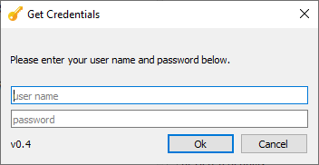
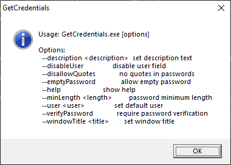

# standalone user/password dialog

This project was created to replace a [Get-Credential](https://docs.microsoft.com/en-us/powershell/module/microsoft.powershell.security/get-credential?view=powershell-7) cmdlet in a script in order to have more customization options.

## Features

(TODO explain features here)

## Building

Install [Qt for Windows](https://doc.qt.io/qt-5/windows.html) and open the project `GetCredentials.pro` in Qt Creator.

## Credits

The [yellow key](https://www.flaticon.com/de/kostenloses-icon/schlussel_1679971) icon was created by [Smashicons](https://www.flaticon.com/de/autoren/smashicons) and downloaded from [Flaticon](https://www.flaticon.com).

## License

[MIT](LICENSE) © 2020 Generali Deutschland Informatik Services GmbH